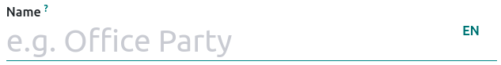
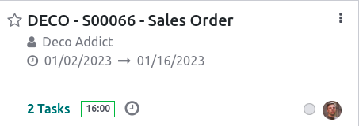

==================
Project management
==================

Odoo Project uses the **Kanban** project management system. This means all projects are broken down
into tasks, which are categorized on a whiteboard according to what production phase they are in.

.. admonition:: Did you know ?

   The word **Kanban** comes from Japanese and refers to the “visual board” management method.

.. seealso:: `Kanban video introduction <https://www.youtube.com/watch?v=DPpnmtQRYY8>`_

Project creation
================

Creation
--------

.. _project-translation:

Open the **Project** app and click :guilabel:`Create` to start a new project. Enter a
:guilabel:`Name` for your project, and if you have **multiple languages** installed on your
database, click on the language acronym to add a **translation** (ex. :guilabel:`EN` for 'English').

Users with the **Invoicing** or **Accounting** app installed also have the option to set the project
as :guilabel:`Billable`, the **Timesheets** app to log time on tasks within the project, and the
**Planning** app to plan resources on tasks within the project.

Customization
-------------

Once created, you can customize your existing **projects** from the dashboard by clicking the
:guilabel:`drop-down toggle button (⋮)` on a project's **card**. This enables a new menu under which
users can access :guilabel:`Documents` related to the task, change the **card's** color, and access
further customization options in :guilabel:`Settings`.

Add color to project
~~~~~~~~~~~~~~~~~~~~

A project can be made more recognizable by changing the color of its **card**. To do so, click on
the :guilabel:`drop-down toggle button (⋮)` and select a color in the bottom-left of the menu.

Documents
~~~~~~~~~

To upload documents to a project, drag and drop the document onto the project's **card**, or go to
:menuselection:`drop-down toggle button (⋮) --> Documents` and click :guilabel:`Upload`. All
uploaded documents can be found under this menu, as well as in the **Documents** app, under
:guilabel:`Projects`.

.. seealso:: `Tutorial video: customize your project <https://www.youtube.com/watch?v=nAatJSiNqp8>`_

Settings
~~~~~~~~

To access the settings of a project, click on the :guilabel:`drop-down toggle button (⋮)` of the
project's **card**, and then :guilabel:`Settings`. From here, the following settings can be changed:

- :guilabel:`Name` of the project;
- Mark the project as :guilabel:`Favorite`, allowing to find it using the :guilabel:`My Favorites`
  filter on the Kanban view;
- :guilabel:`Name of the tasks` found under that project. Similarly to the
  :ref:`project name <project-translation>`, the tasks are also translatable;
- :guilabel:`Customer` for whom the project is intended;
- the :guilabel:`Tags` used for filtering;
- the :guilabel:`Company` responsible for the project;
- the employee designated as :guilabel:`Project Manager`;
- the :guilabel:`Planned Date` of the project;
- the total :guilabel:`Allocated Hours` for that project.

In addition, it is also possible to add a :guilabel:`Project description` in the
:guilabel:`Description` tab, and view related :abbr:`SO (Sales Order)` for that project under the
:guilabel:`Invoicing` tab.

Under the :guilabel:`Settings` tab, an :guilabel:`analytic Account` for that project can be set, as
well as the :guilabel:`Visibility` parameters.

.. todo:: add :ref: for collaborators tab, and expand on the visibility parameters ?

Depending on the **apps** installed on the database, the following options are also available:

- (Project) :guilabel:`Milestones`: track major progress points that must be reached to achieve
  success;
- (Timesheets)